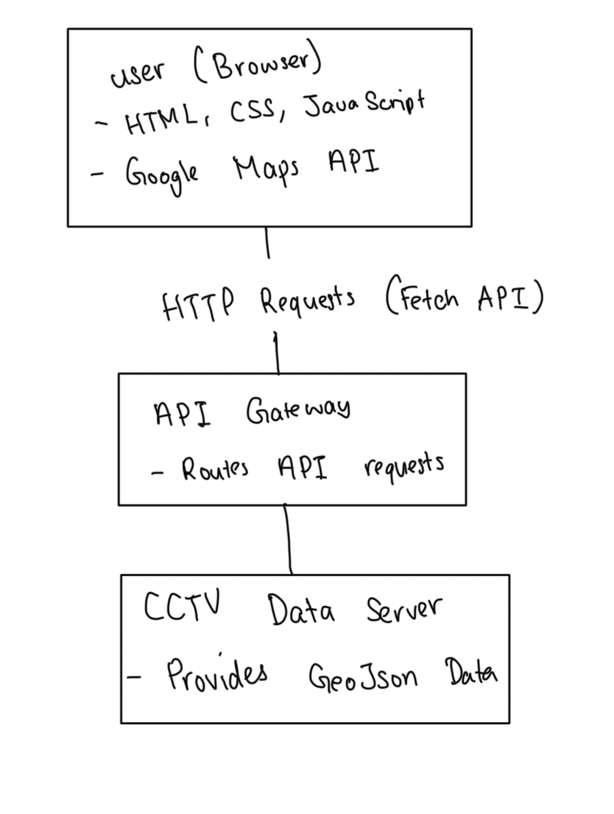

# Implementation

## Introduction
### System Implemented
SeeSeeTV Locator is a web-based application designed to help users locate nearby CCTV cameras using a map interface. The application utilises Google Maps API for map rendering and geolocation, while it fetches real-time CCTV data from an external API provided by Bristol Open Data. This allows users to easily visualise the location of surveillnce cameras in their area.

Features within the web application are:
- Displaying a map for CCTV locations
- Provides real-time user location tracking
- Displays a sorted list of nearby cameras based on distance
- Allows users to view additional camera based on distance

### Dataset Description
CCTV data is fetched from public API, that comes in the format of GeoJSON

### Known Issues
While the application is functional, there has been some issues we have identified like:
1. Geolocation Permission:
   - Users are required to allow browser location access for accurate results
2. Data Availability:
   - If the external API is down or experiencing issues,no CCTV data will be displayed.
3. Accuracy of Data:
   - CCTV location data may not always be up-to-date or accurate
4. Browser Compatability
   - Applicationis optimised for modern browsers, older browsers may not support all features

### Configuration Data
1. Google Maps API Key
   - the API key is embedded in the script for accessing Google Map Services
2. Map Settings:
   - The inital Center is in Bristol
   - Zoom is set at 17
3. Geolocation Settings:
   - high accuracy is true for precise user location
4. Marker Configuration:
   - User Location Marker: Blue
   - CCTV Marker: Red Dot

## Project Structure
TODO: Provide an outline of the project folder structure and the role of each file within it.
provide a table listing the number of jslint warnings/reports for each module.

| File                | Warnings | Error | Descriptions |
| ------------------- | -------- | ----- | ------------ |
| **JavaScript/index.js** |    10    |   0   | Line is longer than 80 characters,  [JSLint was unable to finish] Wrap the parameter before '=>' in parens, Use 'function (...)', not '(...) =>' when arrow functions become too complex.|

| File | Role |
| ---- | ---- |
| **CSS/style.css** | To add styling to the pages |
| **Img/CCTV.jpg**  | Adds an image |
| **Main.html** | Is the main page of the website |
| **Map.html** | Is the map page for the website |
| **Request.html** | Is the request page for the website |

### Software Architecture
### Major Components:
#### Frontend
  - Provides UI for users to view the map, search for nearby CCTV, and see info about each location
  - Uses Google Maps API for map rendering and user location Tracking
  - Fetches CCTV data using REST API and display results with JavaScript
#### Backend
  - CCTV data is retrieved from remote servers using a RESTful API
  - Additional services for handling requests and serving data
#### Data Layer
  - GeoJSON format, geographical data, coordinates and properties for each CCTV
#### Third Party 
  - Google Maps API for map rendering, plotting markers, and user location display

### Architecture Style:
#### Client-Server Architecture 
- Frontend (Client) requests data from backend (API) using HTTP requests
- API responds with GeoJSON format

#### Event Driven
- Event listeners for geolocation updates, button clicks and fetch API responses 

## Bristol Open Data API
TODO: Document each query to Bristol Open Data

TODO: Repeat as necessary

# User guide
1. Viewing the Homepage
   - Steps:
   1. Open the browser and go to the SeeSeeTV locator website
   2. Homepage will load, displaying a navigation bar with:
      - Home
      - Maps
      - Requests
   3. Verify the link is highlighted as active page

2. Viewing nearby CCTV camera on the Map
   - Steps:
   1. Click Maps in the navigation bar
   2. Allow location Access
   3. Map will load, showing current loaction with a blue marker
   4. Red markers will appear representing nearby CCTV
   5. Hovering or clicking red markers to view more details

3. Viewing a List of Nearby CCTV Cameras
   - Steps:
   1. You will see a panel on the left labeled "Nearby CCTV" in Maps.
   2. It Fetches Data from the API and displays a list of the CCTV in the area sorted by closest
   3. Each item in the list includes camera location details

4. Submitting a request
   - Steps:
   1. Click on Requests from the Navigation Bar
   2. Fill out the form
   3. Submit for by clicking Submit Button
