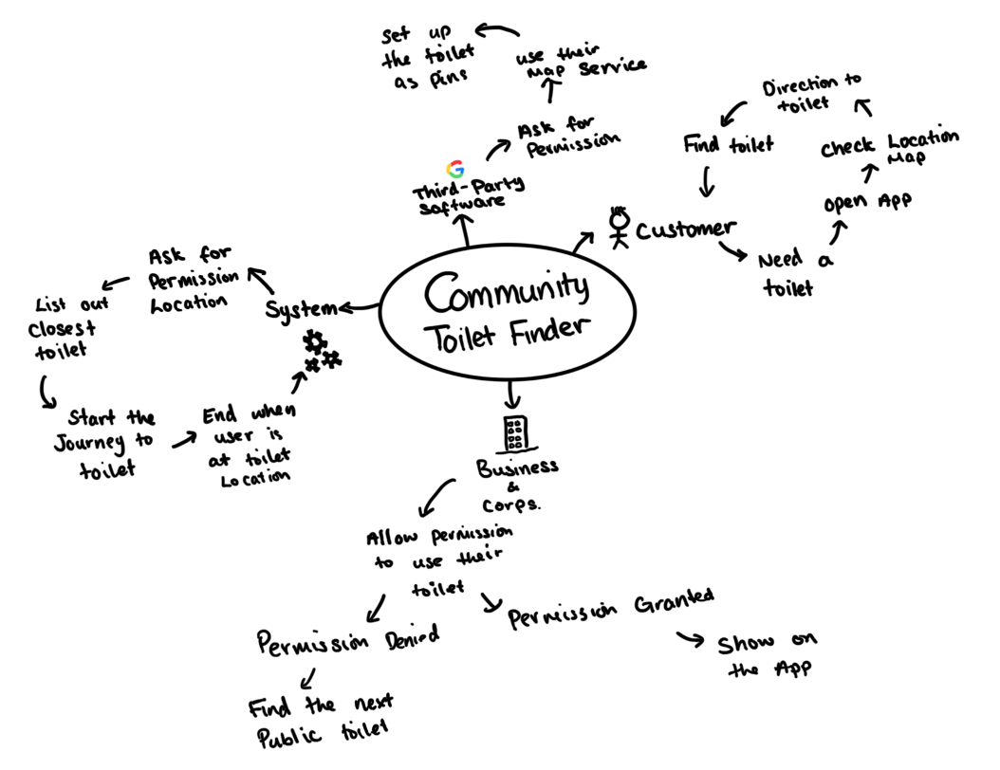

# Project Proposal

## Business Case

### Problem statement
TODO: Replace the example text like this with text that describes your project. What is the problem to be addressed?

// Owen // There are too much crimes happening on the streets of Bristol, providing the public with CCTV locations may allow the public to be wary of the places that are in the dark.

### Business benefits
TODO: List high-level benefits that this product will provide.

- Collaborating with local businesses with a public restroom could increase people walking around more often to these businesses, creating - more visitors to the business providing more potential customers.
- Collaborating with travel industries could help the industry with finding clean and safer public toilets.
- Having users provide feedback to the app, making the specific places more appealing for others to visit.
- If this app was to expand over to different countries it could be easy to add into the app.

### Options Considered
TODO: What are some other customer options or leading products that address the same needs?

### Expected Risks
TODO: What are the main risks of this project?

-	Some external businesses and corporations denying entrance to their toilet, we will need to find the next closest toilet.
-	Potential risk with location accuracy, if the user doesn’t provide the app with precise up to date locations the directions to the toilet will be incorrect.
-	The app may show toilets that no longer exists or have too long of a queue.
-	Data Breach may occur as it requires sensitive data from the user.
-	Users may not want to use this app as it is not engaging enough.
-	Need to ensure the safety of the toilets, the toilets aren’t in a closed area with potential risks to the user.

 

## Project Scope

