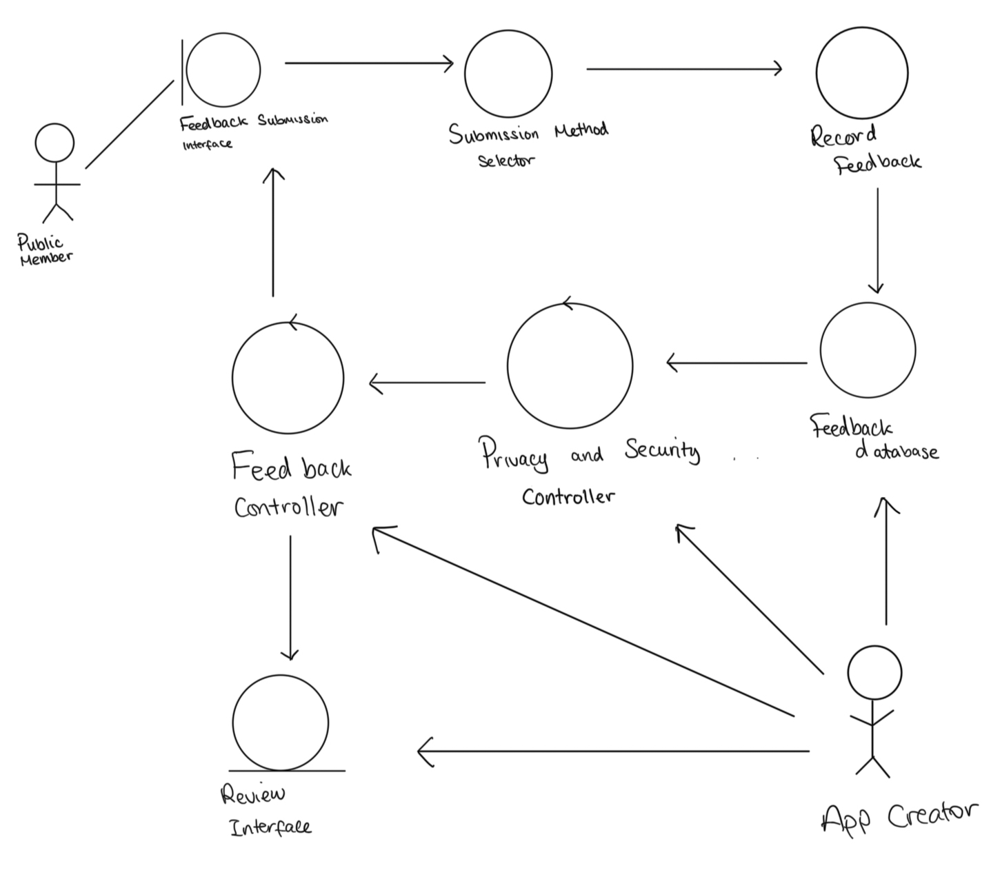

# Requirements

## User Needs

### User stories

// Owen //  

As a member of the public I would want to see the places of where the CCTV's are located so that I can provide locations to where CCTV could be placed, in specific areas that feel unsafe. In addition to this as a member of public i would like to know where the locations of CCTVs are placed so that I could have reassurance that I would have a safer journey.

As the app creators, I want to create a app that ensures safety to the members of the public so that it allows access to everyone on where CCTV's are. I also would like to make the app easily available and straight to the point so that anyone of any age can find it straightforward to use. 

As a Councillor I want to ensure the safey of the civillians so that there will be more visitors to the city. This could benefit other businesses as a safer city would bring in more customers.

As a Secuirty guard I want to make patrols effiecient and effective for the public so that I am able to effectively tackle crimes in more dangerous areas.
//Pujan//
As police officers, i would want to use the app to know which areas do not have many CCTV cameras so that I could focus more on those areas to prevent more crimes from happening.

### Actors

// Owen //
- Public Member
  - To access the CCTV's and see where they are placed.
  - To Provide feedback on where they think a CCTV should be placed.
  - Raise awareness to crime prevention
 
- App Creator
  - Managing new and up-to-date information on where the CCTV are.
  - Making sure there is data privacy for all users

- Council
  - Finds Areas that are not covered very well or little coverages and adds CCTV
 //Pujan//
- Security Guard
  - Finds area that requires more patrol due to the lack of CCTV cameras

- Police Officers
  - Focus on areas that have less CCTVs to help prevent more crimes from taking place.

### Use Cases

| TODO: USE-CASE ID e.g. UC1, UC2, ... | TODO: USE-CASE NAME | 
| -------------------------------------- | ------------------- |
| **Description** | TODO: Goal to be achieved by use case and sources for requirement |
| **Actors** | TODO: List of actors involved in use case |
| **Assumptions** | TODO: Pre/post-conditions if any</td></tr>
| **Steps** | TODO: Interactions between actors and system necessary to achieve goal |
| **Variations** | TODO: OPTIONAL - Any variations in the steps of a use case |
| **Non-functional** | TODO: OPTIONAL - List of non-functional requirements that the use case must meet. |
| **Issues** | TODO: OPTIONAL - List of issues that remain to be resolved |

// Owen //

| Use Case 1 | Community Feedback | 
| -------------------------------------- | ------------------- |
| **Description** | Allowing residents to suggest locations on where they feel unsafe |
| **Actors** | Public Member and The App Creator |
| **Assumptions** | Assumes that everyone haves a way to access to a smart phone and computers </td></tr>
| **Steps** | Public Member uses an in-app feature to request some CCTV's at the given location |
| **Variations** | Feedback Submission requests can be done different ways, done by email, phone calls and websites aswell |
| **Non-functional** | The app should be usable by everyone and no limitations, Data Privacy and Protection |
| **Issues** | If no one provides feedback then the data on where the CCTV needs to be installed is not going to go through |

//Pujan// 

| Use Case 2 | Routing |
| -------------------------------------- | ------------------- |
| **Description** | Allowing the public to create a route that helps them get to a place safer |
| **Actors** | Public Member |
| **Assumptions** | Assumes that there everyone has similar routes home and has access to mobile data to access it outside </td></tr>
| **Steps** | Public members use an in-app feature that uses google maps to create a route to allow a safer journey |
| **Variations** | The members of public can create a route by entering a start location and an end location or they can use the map to see all location of CCTVs to make their own journey |
| **Non-functional** | The app should be easy to use so that people all ages can use the app. |
| **Issues** | CCTVs are not everywhere so people can not make a route for anywhere across the city |

 //Owen//

 //Pujan//

## Software Requirements Specification
### Functional requirements

- FR1: The system shall allow the members of public to know the locations of all of the CCTVs in a city.
- FR2: The system shall allow the members of public to give feedback to allow the app creator to help improve the system.
- FR3: The system shall allow the members of public to create a route based of knowing where CCTVs are for a safer journey.

### Non-Functional Requirements

- NFR1: The pins that show the locations of CCTVs should load onto the map in less than 5 seconds
- NFR2: The route selected should be generated in less than 4 seconds
- NFR3: The feedback from customer's should be sent instantly to the app creators
- NFR4: The app should show all CCTV location within a 1 mile radius.

Indicate which UC the requirement comes from.
